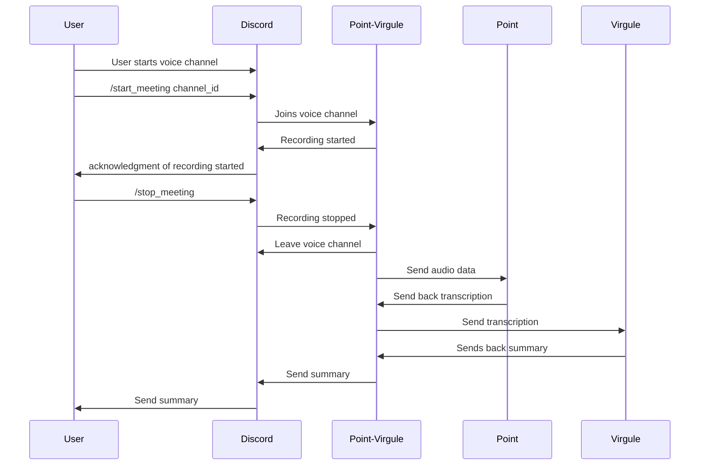

# point-virgule

point-virgule est un bot Discord conçu pour rejoindre des canaux vocaux, enregistrer de
l'audio et l'envoyer a un service de transcription automatique.

Séquence de fonctionnement:



## Prérequis

- Python
- Docker (optionnel, pour le déploiement containerisé)

## Utilisation

```sh
git clone https://github.com/yourusername/point-virgule.git
cd point-virgule
pip install -r requirements.txt
python main.py
```

### Docker

Construire et exécuter l'image Docker:

```sh
docker build -t point-virgule .
docker run -d --name point-virgule point-virgule
```

## Commandes

- `/start_meeting [channel]`: Rejoindre le canal vocal spécifié et commencer
  l'enregistrement.
- `/stop_meeting`: Arrêter l'enregistrement et sauvegarder le fichier audio.
